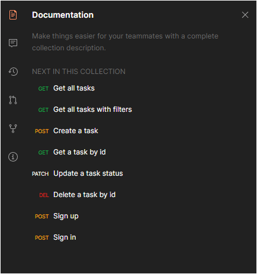

## Description
A task management app.  
*A course from Udemy*  
*[NestJS Zero to Hero - Modern TypeScript Back-end Development](https://www.udemy.com/course/nestjs-zero-to-hero/)*

## Installation

```bash
$ yarn install
```

## Running the app

```bash
# setup .env
$ cp .env.example .env
# run docker
$ docker-compose up -d
# watch mode
$ yarn start:dev
```

## Stack

- Docker
- Joi
- Nestjs
- Passport.js (JWT)
- Postgres
- TypeORM (v0.2, repository)

## Screenshot

